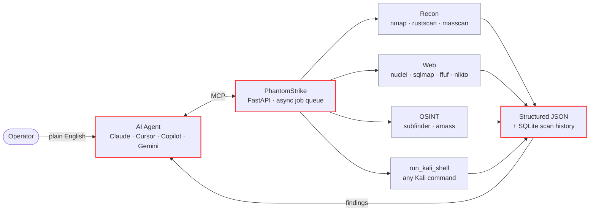

<div align="center">

<picture>
  <source media="(prefers-color-scheme: dark)" srcset="./assets/hero-dark.svg">
  <source media="(prefers-color-scheme: light)" srcset="./assets/hero-light.svg">
  
</picture>

<br/>

[](https://github.com/Red-Snow?tab=followers)
[](https://github.com/Red-Snow)
[](#featured-work)
[](#toolkit)

</div>

---

```console
$ whoami
Red-Snow — offensive security engineer · AI tooling builder

$ cat ./focus.md
[1] PhantomStrike ........ AI agents that run real penetration tests
[2] AI-Malware-Analyzer .. browser-native DFIR, zero backend
[3] Research ............. Conformer networks for physiological signals
```

I build the layer between AI agents and real security work — MCP servers, structured tool
output, and forensic pipelines that return evidence instead of guesses. On the research side:
convolution-augmented Transformers for physiological signal analysis.

---

## Featured Work

<table>
<tr>
<td width="50%" valign="top">

### ⚡ [PhantomStrike](https://github.com/Red-Snow/phantomstrike)

An MCP server that hands any AI agent a full Kali toolchain.
Natural language in, structured multi-step pentest out.

<sub>`Python` · `FastAPI` · `MCP` · `Docker`</sub>

[](https://github.com/Red-Snow/phantomstrike/stargazers)
[](https://github.com/Red-Snow/phantomstrike/commits)

</td>
<td width="50%" valign="top">

### 🔬 [AI-Malware-Analyzer](https://github.com/Red-Snow/AI-Malware-Analyzer)

A complete DFIR workflow that never leaves the browser tab —
PE parsing, IOC extraction, ATT&CK mapping, PDF evidence.

<sub>`JavaScript` · `10+ LLM engines` · `zero-backend`</sub>

[](https://github.com/Red-Snow/AI-Malware-Analyzer/stargazers)
[](https://github.com/Red-Snow/AI-Malware-Analyzer/commits)

</td>
</tr>
<tr>
<td width="50%" valign="top">

### 🕵️ [StegInsight-Forensics](https://github.com/Red-Snow/StegInsight-Forensics)

Steganography detection across text, image and audio/video
carriers, built for fast forensic triage.

<sub>`TypeScript` · `DSP` · `entropy analysis`</sub>

[](https://github.com/Red-Snow/StegInsight-Forensics/stargazers)
[](https://github.com/Red-Snow/StegInsight-Forensics/commits)

</td>
<td width="50%" valign="top">

### 🌐 [redsnow-recon-toolkit](https://github.com/Red-Snow/redsnow-recon-toolkit)

A browser-based recon and OSINT lab — interactive threat
analysis, simulated probes, and an AI cyber mentor.

<sub>`TypeScript` · `OSINT` · `LLM`</sub>

[](https://github.com/Red-Snow/redsnow-recon-toolkit/stargazers)
[](https://github.com/Red-Snow/redsnow-recon-toolkit/commits)

</td>
</tr>
</table>

---

## How PhantomStrike Works

> One sentence from the operator becomes a chained, multi-tool engagement —
> and comes back as parsed JSON, not scrollback.



```text
"Scan 192.168.1.1 for open ports, then audit every web service for SQLi."

  → nmap        discovers 22, 80, 8080
  → nuclei      fingerprints two web stacks
  → sqlmap      confirms injection on /search?q=
  → report      severity-ranked JSON ✓
```

|  | |
|:--|:--|
| **Deploys as** | All-in-Kali · Split (Host + VM) · Docker |
| **Speaks to** | Claude Desktop · Cursor · VS Code + Copilot · Gemini CLI · any MCP client |
| **Ships with** | 12 structured plugins · async job queue · SQLite history · OpenAPI docs |
| **Escape hatch** | `run_kali_shell` — any Kali command, driven by the agent |

<div align="center">

[](https://github.com/Red-Snow/phantomstrike)
&nbsp;
[](https://github.com/Red-Snow/AI-Malware-Analyzer)

</div>

---

## Toolkit

<table>
<tr><td valign="middle" width="130"><b>Offensive</b></td><td>


</td></tr>
<tr><td valign="middle"><b>AI / ML</b></td><td>


</td></tr>
<tr><td valign="middle"><b>Platform</b></td><td>


</td></tr>
<tr><td valign="middle"><b>Agents</b></td><td>


</td></tr>
</table>

---

## Current Work

<table>
<tr>
<td width="50%" valign="top">

**Agentic security & forensics**

Autonomous recon → exploitation → reporting, with every tool
returning structured output an agent can actually reason over.

- LLM tool-chaining for pentest workflows
- Natural-language execution layers over real binaries
- Hidden-data detection across carriers

</td>
<td width="50%" valign="top">

**Physiological deep learning**

Convolution-augmented Transformer (Conformer) architectures for
signal processing and assessment.

- Automated signal decomposition
- Hybrid neural architectures
- Cross-validation on expansive datasets

</td>
</tr>
</table>

<div align="center">


</div>

---

<div align="center">

[](https://github.com/Red-Snow)
[](https://github.com/Red-Snow/phantomstrike/issues)

<sub>*"The quieter you become, the more you are able to hear."*</sub>

</div>
